# Exemple d’un Aspect avec AspectJ
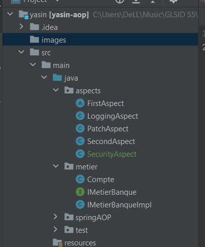

## first test
 #### first aspect 
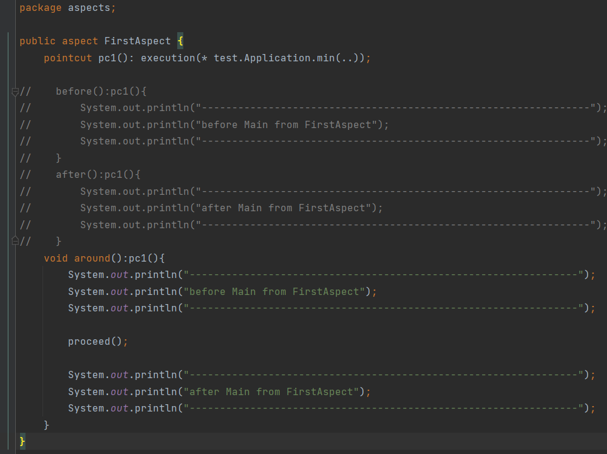
#### second aspect
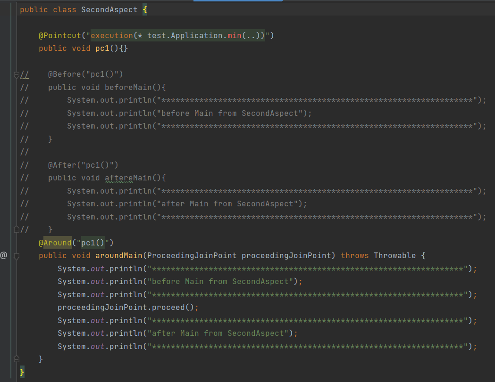
#### result
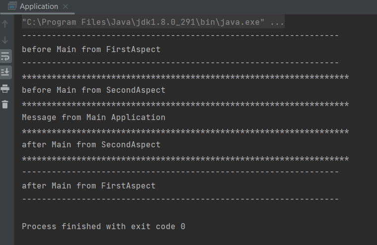

## second test

#### code metier
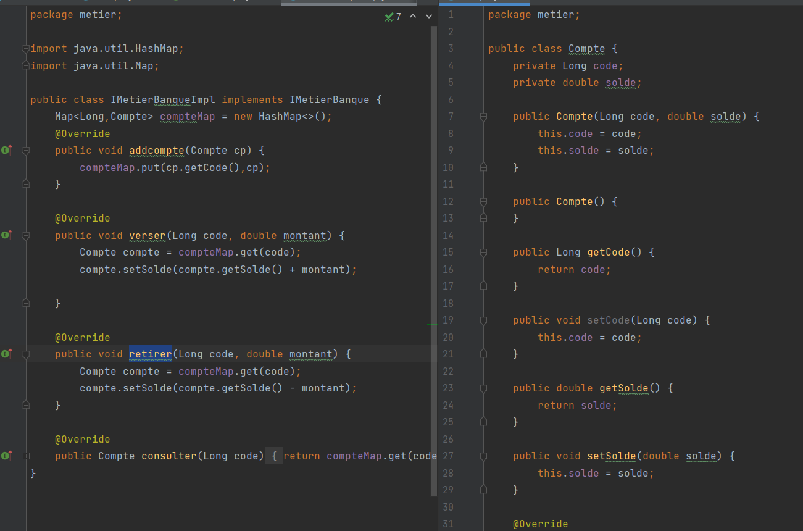
#### LoggingAspect 
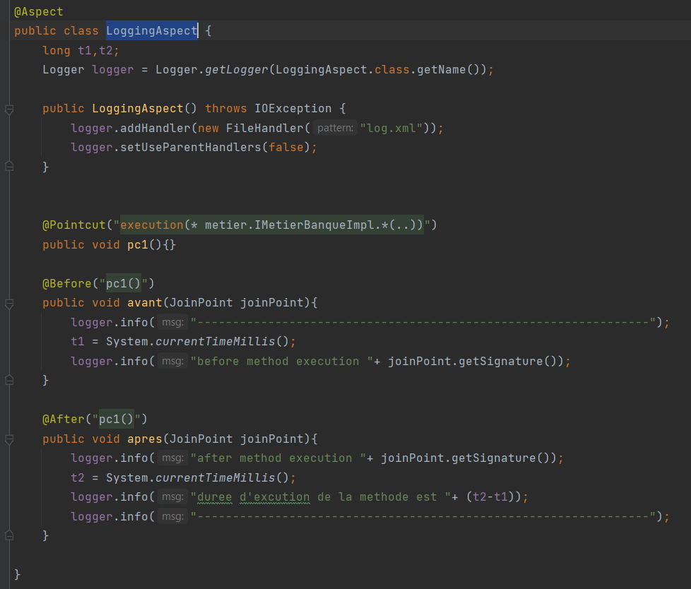
#### SecurityAspect 

#### PatchAspect
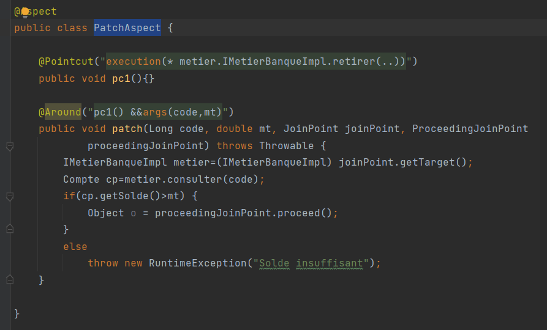

#### main application (method start)
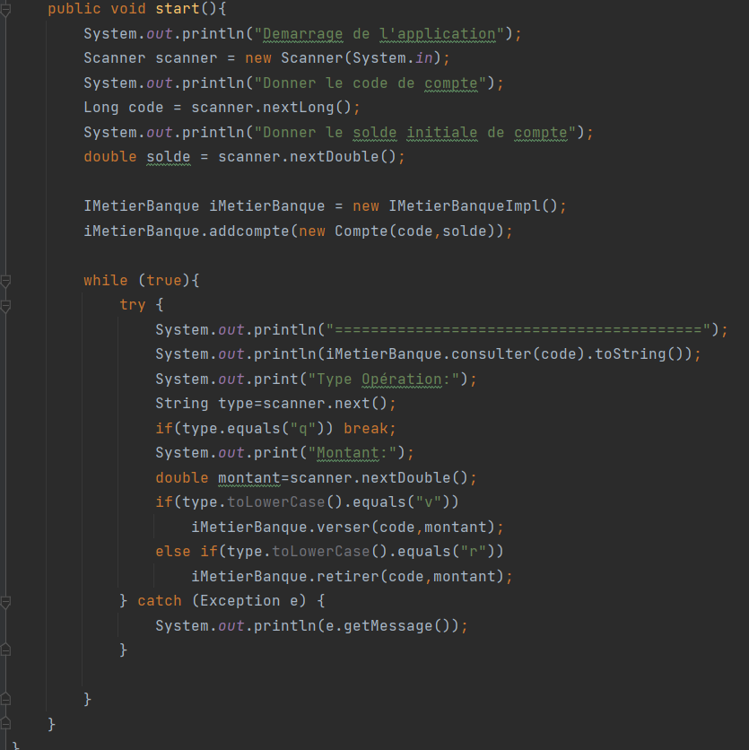

#### result
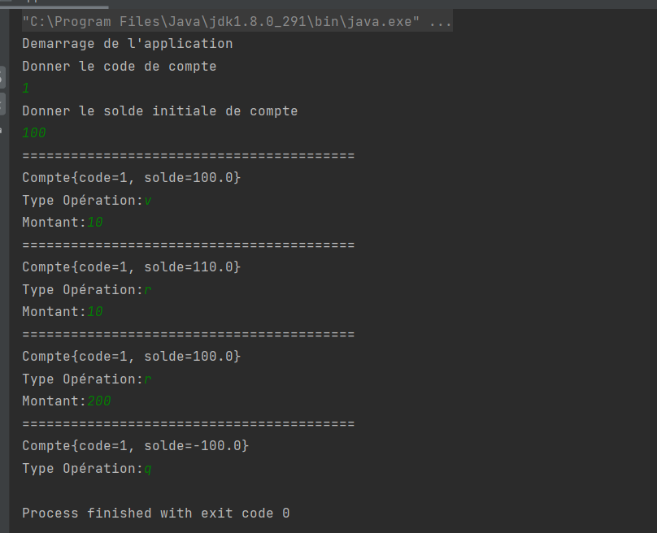
#### logs
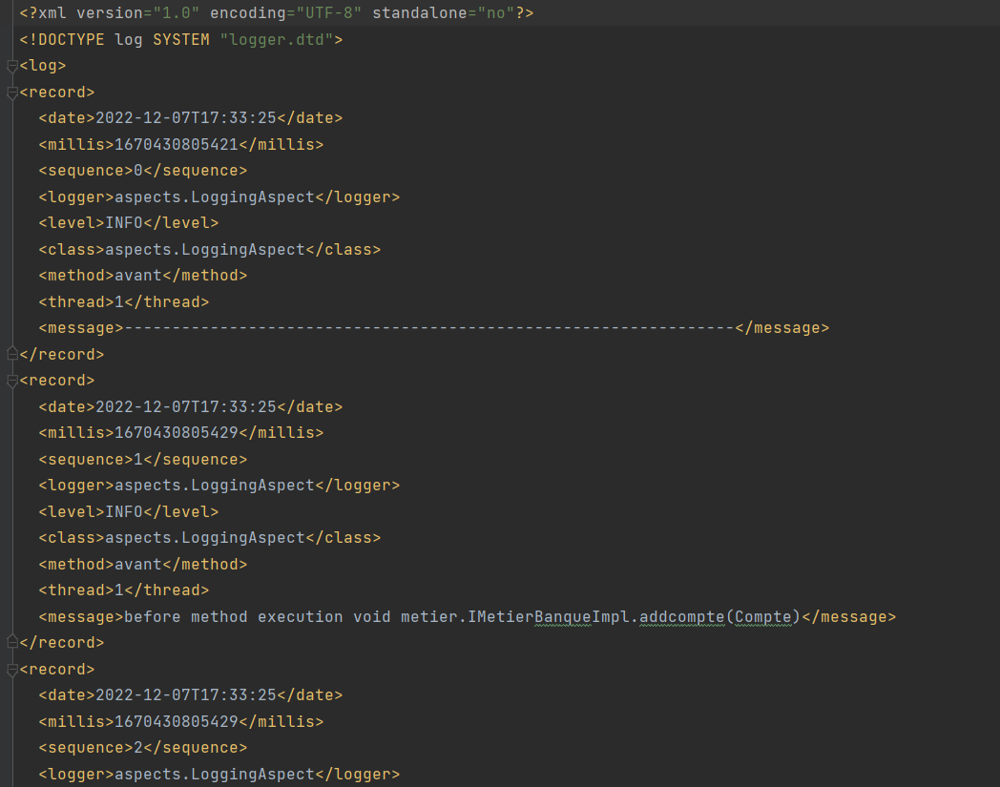

# Exemple Spring AOP
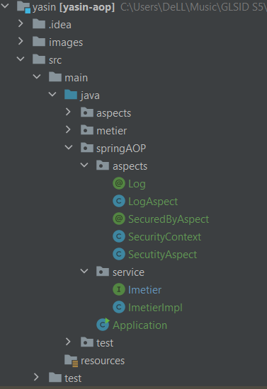

#### code metier
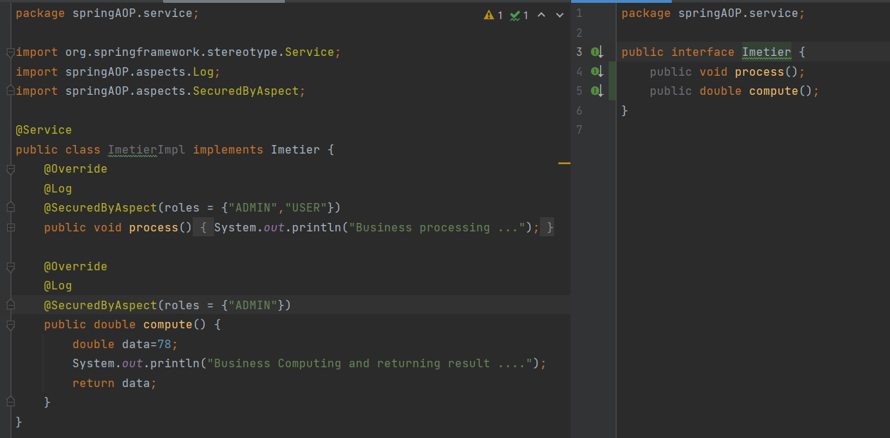
#### Annotations
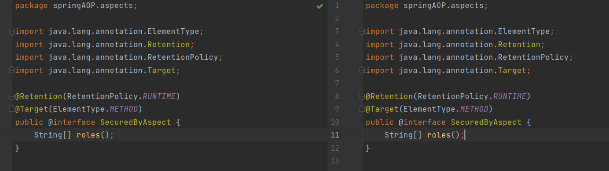
#### LogAspect
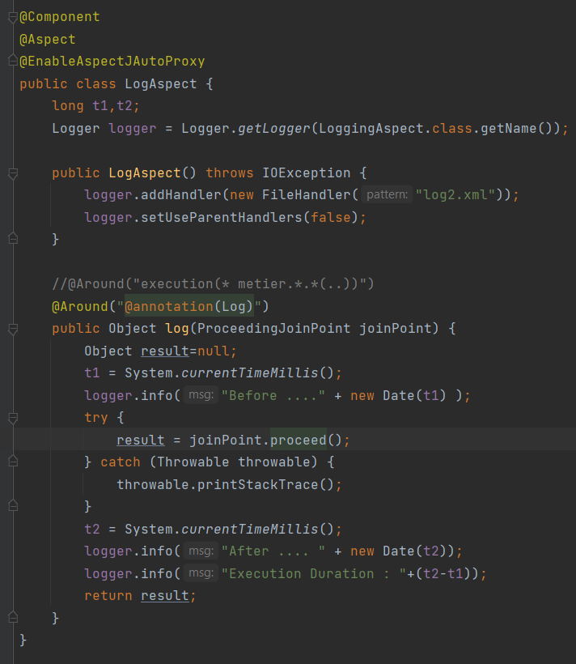
#### securityAspect
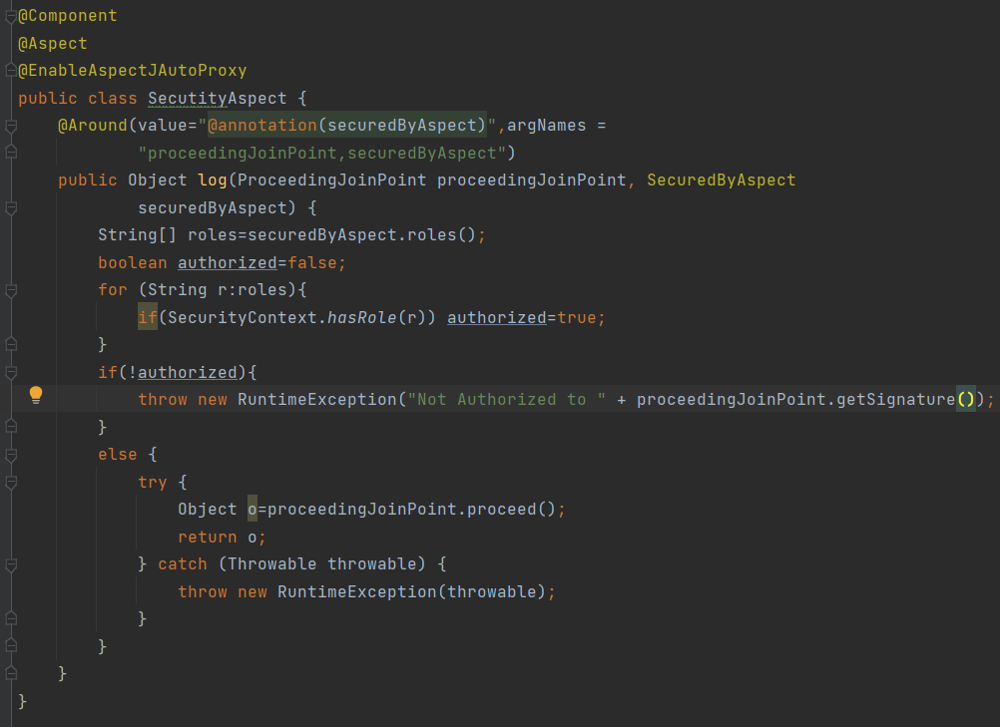

#### main application (method start)

#### result with role USER
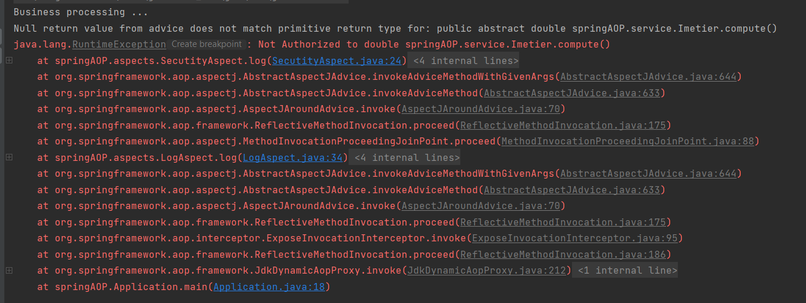
#### result  with role ADMIN
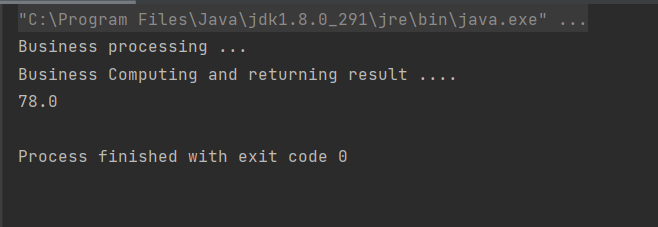
#### logs
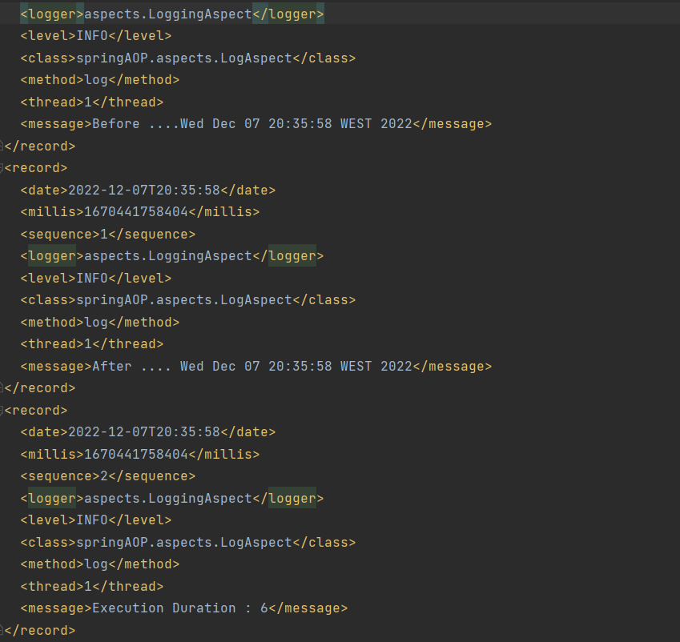

