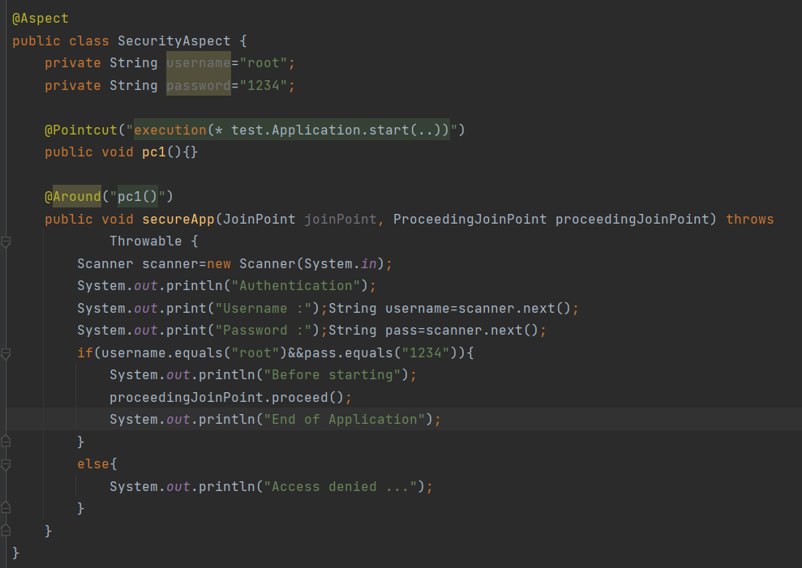
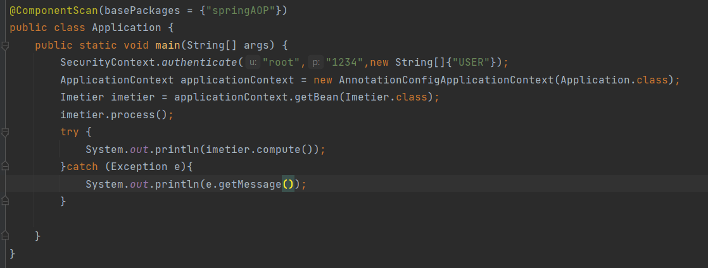

# Exemple d’un Aspect avec AspectJ

## first test
 #### first aspect 

#### second aspect

#### result

## second test

#### code metier

#### LoggingAspect 

#### SecurityAspect 

#### PatchAspect

#### main application (method start)

#### result

#### logs

# Exemple Spring AOP

#### code metier

#### Annotations

#### LogAspect

#### securityAspect

#### main application (method start)

#### result with role USER

#### result  with role ADMIN

#### logs

